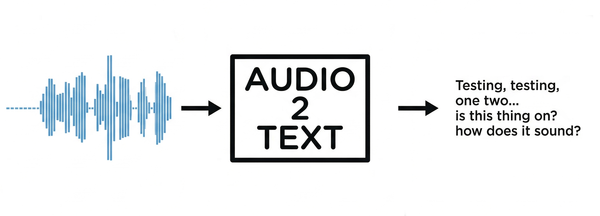

<!--
*** Thanks for checking out the Audio2Text Readme. If you have a suggestion
*** that would make this better, please fork the repo and create a pull request
*** or simply open an issue with the tag "enhancement".
*** 
*** I imagine a world where scientific knowledge provides solutions for every health challenge, enabling everyone to live with autonomy, freedom, and well-being.
*** I created this project so that I could interface with audio to text models from Nvidia, which give a little bit more accuracy over the transcription compared to Word or Google Document transcription in my personal experience. I hope this might be of use to others as well.
-->

<!-- PROJECT LOGO -->   
    <h3 align="center">Audio2Text Transcription (Audio2Text)</h3> 
 A Python-based UI for audio-to-text transcription using Nvidia's Canary and Parakeet models   <a href="https://github.com/kscrudders/Audio2Text"><strong>Explore the docs »</strong></a>     <a href="https://github.com/kscrudders/Audio2Text/issues">Report Bug</a> · <a href="https://github.com/kscrudders/Audio2Text/issues">Request Feature</a> 
 
 <!-- TABLE OF CONTENTS --> 
 
Table of Contents
 <ol> <li><a href="#about-the-project">About The Project</a></li> <li><a href="#built-with">Built With</a></li> <li><a href="#getting-started">Getting Started</a> <ul> <li><a href="#prerequisites">Prerequisites</a></li> <li><a href="#installation">Installation</a></li> </ul> </li> <li><a href="#usage">Usage</a></li> <li><a href="#roadmap">Roadmap</a></li> <li><a href="#contributing">Contributing</a></li> <li><a href="#license">License</a></li> <li><a href="#contact">Contact</a></li> <li><a href="#acknowledgments">Acknowledgments</a></li> </ol> 
 <!-- ABOUT THE PROJECT -->
About The Project: 

Audio2Text provides a convenient graphical interface to interact with Nvidia's custom Canary and Parakeet models for audio-to-text transcription. It helps users:

- Record high-quality audio directly within the application.

- Load existing audio files (.wav, .mp3, .m4a, etc.) for bulk processing.

- Dynamically select between the smaller, faster Parakeet model or the larger, higher-accuracy Canary model based on available GPU VRAM.

- Normalize and chunk audio using Voice Activity Detection (VAD) to ensure optimal model processing.

- Output high-precision English text directly to the UI with a quick "Copy to Clipboard" workflow.

This application is particularly useful to anyone who wants precise transcription capabilities that outperform the default tools in Word or Google Documents, functioning seamlessly on consumer-grade to high-end Nvidia GPUs.

(<a href="#readme-top">back to top</a>)
 <!-- BUILT WITH -->

Built With Python 3.12:
External Dependencies:
- FFmpeg (place FFmpeg.exe in the application directory - https://www.ffmpeg.org/download.html#build-windows or https://www.gyan.dev/ffmpeg/builds/)
	- at gyan.dev download ffmpeg-git-full.7z, FFmpeg.exe is in the bin folder
	

(<a href="#readme-top">back to top</a>)
 <!-- GETTING STARTED -->

Getting Started 

Follow these instructions to run Audio2Text on your local machine.

Prerequisites: 

Dependencies are indicated in the Dependencies.txt file:
- Only tested on Nvidia GPUs (tested using 3070, 3090, 5070 ti)
    - Canary Model: Requires 12+ GB VRAM (e.g., RTX 3090 24GB, RTX 5070 Ti 16GB).
    - Parakeet Model: Works on GPUs with <12 GB VRAM (e.g., RTX 3070 8GB)
- Python 3.12
- Various python packages indicated in the Dependencies.txt

Installation: 

* Clone the repository:
* sh
* Copy
* Edit
* git clone https://github.com/kscrudders/Audio2Text.git

Install required packages:
- Open your terminal or command prompt.
- Navigate to the cloned folder. 
- Activate the python local environment: cd C:\Users\...\Audio2Text\Scripts\activate
- Run pip install -r requirements.txt (Check requirements.txt to ensure your PyTorch installation matches your CUDA version).

(<a href="#readme-top">back to top</a>)
 <!-- USAGE EXAMPLES -->

Usage: 

* Double click 'audio2text.pyw':
* Follow prompts to select your preferred model, record or load audio, and copy text once processed.

(<a href="#readme-top">back to top</a>)
 <!-- ROADMAP -->

## Roadmap

- [x] Integrate Nvidia Parakeet and Canary models
- [x] Dynamic chunking and alignment-aware stitching
- [x] CustomTkinter graphical interface
- [ ] Fix hard crashing with the Parakeet model implementation (source of error unknown)

See the [open issues](https://github.com/kscrudders/Audio2Text/issues) for a full list of proposed features (and known issues).

(<a href="#readme-top">back to top</a>)
 <!-- CONTRIBUTING -->

Contributing: 

Contributions make this script more robust and easier to use. If you have suggestions:
* Fork the Project
* Create your Feature Branch (git checkout -b feature/YourFeature)
* Commit your Changes (git commit -m 'Added an awesome feature')
* Push to the Branch (git push origin feature/YourFeature)
* Open a Pull Request

(<a href="#readme-top">back to top</a>)
 <!-- LICENSE -->

License: 

This project is distributed under GNU General Public License. 

See LICENSE.txt for details.

(<a href="#readme-top">back to top</a>)
 <!-- CONTACT -->
Contact 

Kevin Scrudders – kscrudders@gmail.com

Project Link: https://github.com/kscrudders/Audio2Text

(<a href="#readme-top">back to top</a>)
 <!-- ACKNOWLEDGMENTS -->

Acknowledgments
* Most code was written by Gemini 3 Pro. Variables and settings were tuned by KLS and research on audio normalization and chunking was done by KLS. 
* All code was approved and tested by Kevin.

(<a href="#readme-top">back to top</a>)

